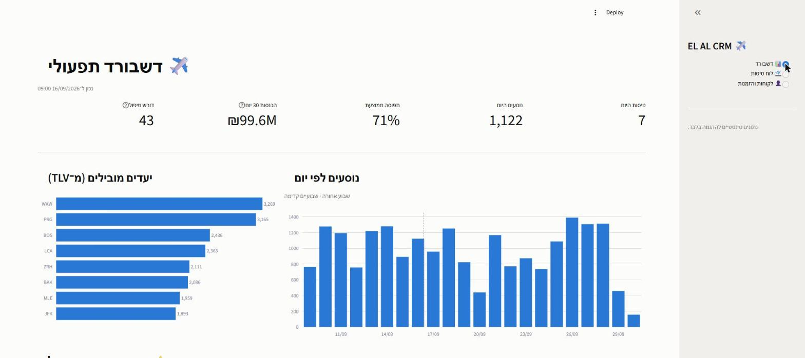
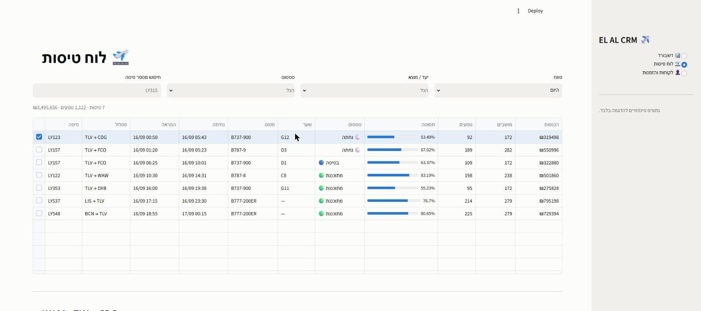
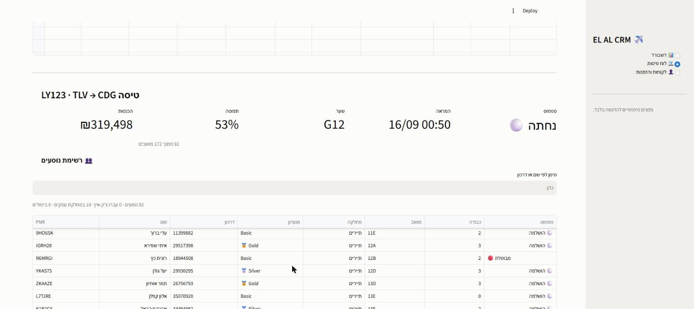
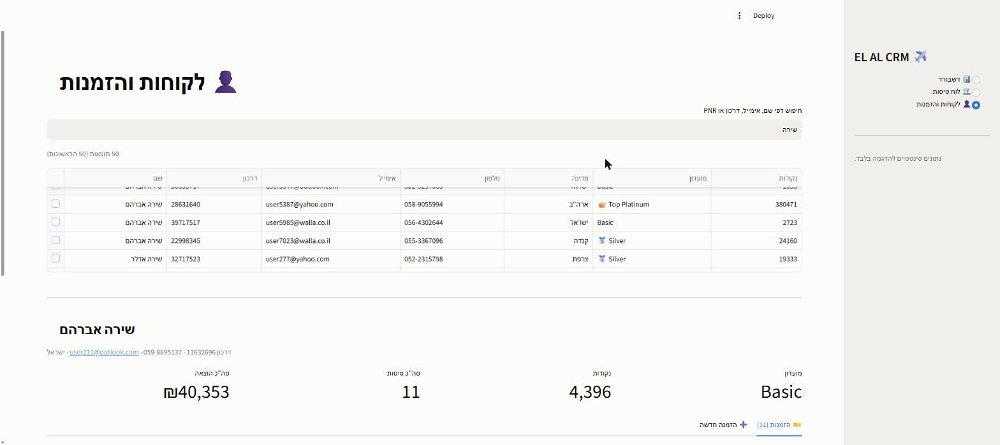

# ✈️ EL AL CRM — מערכת לסוכני נסיעות

מערכת CRM להדגמה, שמאפשרת לסוכן נסיעות של אל על לעקוב אחרי לוח הטיסות ולנהל את רישום הלקוחות לטיסות.
בנויה ב־**Streamlit** מעל **SQLite**, עם דאטה סינטטי שנוצר מקומית.

> ⚠️ **פרויקט הדגמה בלבד.** כל הנתונים סינטטיים ונוצרים על ידי `generate_data.py`.
> אין כאן שום חיבור למערכות אל על, ואין שום נתון אמיתי של לקוח.

---

## מסכים

### 📊 דשבורד תפעולי
מדדי מפתח, נפח נוסעים יומי סביב "היום", יעדים מובילים, וטבלת טיסות שדורשות טיפול.



### 🛫 לוח טיסות
פילטרים לפי טווח, יעד, סטטוס וחיפוש מספר טיסה. עמודת תפוסה כבר גרפי.



### רשימת נוסעים
בחירת טיסה פותחת את פרטיה ואת המניפסט — PNR, דרכון, דרגת מועדון, מושב וסטטוס צ'ק-אין,
עם סינון לפי שם או דרכון.



### 👤 לקוחות והזמנות
חיפוש לקוח לפי שם, אימייל, דרכון או PNR. כרטיס הלקוח מציג דרגת מועדון, נקודות והיסטוריית
טיסות — ומאפשר לבצע צ'ק-אין, לבטל הזמנה, או לפתוח הזמנה חדשה.



---

## התקנה והרצה

```bash
pip install -r requirements.txt
python generate_data.py      # יוצר את elal_crm.db — פעם אחת
streamlit run app.py
```

האפליקציה תיפתח ב־<http://localhost:8501>.

> `elal_crm.db` לא נשמר ב־git (14MB). הגנרטור משתמש ב־`seed=42`,
> כך שכל הרצה מייצרת בדיוק את אותו מסד נתונים.

---

## מבנה

```
schema.sql          סכמת שלוש טבלאות + אינדקסים
generate_data.py    גנרטור הדאטה הסינטטי
app.py              אפליקציית Streamlit
.streamlit/         ערכת צבעים
docs/               צילומי מסך
```

## מודל הנתונים

```
customers ──< bookings >── flights
```

| טבלה | תוכן | כמות |
|---|---|---|
| `customers` | לקוחות, כולל דרגת מועדון הנוסע המתמיד | 8,000 |
| `flights` | טיסות מ־30 יום אחורה עד 60 יום קדימה, 28 יעדים | 545 |
| `bookings` | הזמנות עם PNR, מושב, כבודה ומחיר בשקלים | 93,723 |

הדאטה **נגזר מהזמן**: טיסה שכבר נחתה מסומנת `Landed` וההזמנות שלה `Completed`;
טיסה עתידית `Scheduled` וההזמנות `Confirmed`. בחירת המטוס מוגבלת לפי טווח היעד,
כך ש־737 לא טס ללוס אנג'לס, והמושבים ייחודיים לכל טיסה — בלי הקצאה כפולה.

## מה המערכת יודעת לעשות

**קריאה** — לוח טיסות עם תפוסה וסטטוס, דשבורד תפעולי, מניפסט נוסעים, כרטיס לקוח
עם היסטוריית טיסות והוצאה מצטברת, חיפוש לפי שם / אימייל / דרכון / PNR.

**כתיבה** — פתיחת הזמנה חדשה (הושבה אוטומטית במושב הפנוי הראשון, מחיר לפי מחלקה),
ביטול הזמנה (משחרר את המושב), וצ'ק-אין. כל כתיבה מנקה את ה-cache כדי שהמסכים
יציגו מיד את המצב החדש.

---

## Phases

| # | תוכן | סטטוס |
|---|---|---|
| 1 | מודל נתונים + דאטה סינטטי | ✅ |
| 2 | דשבורד + לוח טיסות | ✅ |
| 3 | ניהול לקוחות והזמנות | ✅ |

## דרישות

Python 3.11+ · Streamlit · pandas · Plotly
