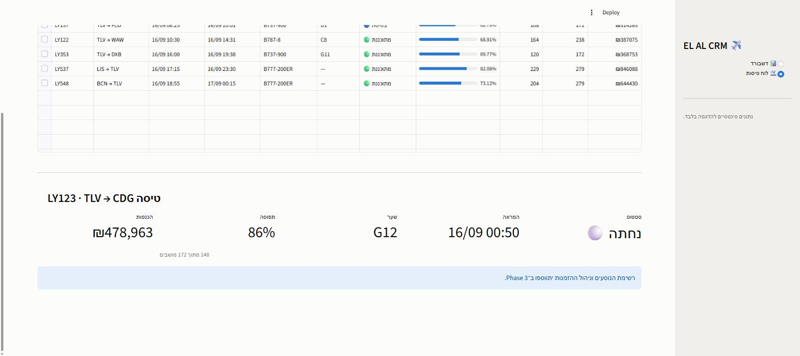

# ✈️ EL AL CRM — מערכת לסוכני נסיעות

מערכת CRM להדגמה, שמאפשרת לסוכן נסיעות של אל על לעקוב אחרי לוח הטיסות ולנהל את רישום הלקוחות לטיסות.
בנויה ב־**Streamlit** מעל **SQLite**, עם דאטה סינטטי שנוצר מקומית.

> ⚠️ **פרויקט הדגמה בלבד.** כל הנתונים סינטטיים ונוצרים על ידי `generate_data.py`.
> אין כאן שום חיבור למערכות אל על, ואין שום נתון אמיתי של לקוח.

---

## מסכים

### 📊 דשבורד תפעולי
מדדי מפתח, נפח נוסעים יומי סביב "היום", יעדים מובילים, וטבלת טיסות שדורשות טיפול.


### 🛫 לוח טיסות
פילטרים לפי טווח, יעד, סטטוס וחיפוש מספר טיסה. עמודת תפוסה כבר גרפי.


### פרטי טיסה
בחירת שורה בטבלה פותחת פאנל עם פרטי הטיסה.



---

## התקנה והרצה

```bash
pip install -r requirements.txt
python generate_data.py      # יוצר את elal_crm.db — פעם אחת
streamlit run app.py
```

האפליקציה תיפתח ב־<http://localhost:8501>.

> `elal_crm.db` לא נשמר ב־git (14MB). הגנרטור משתמש ב־`seed=42`,
> כך שכל הרצה מייצרת בדיוק את אותו מסד נתונים.

---

## מבנה

```
schema.sql          סכמת שלוש טבלאות + אינדקסים
generate_data.py    גנרטור הדאטה הסינטטי
app.py              אפליקציית Streamlit
.streamlit/         ערכת צבעים
docs/               צילומי מסך
```

## מודל הנתונים

```
customers ──< bookings >── flights
```

| טבלה | תוכן | כמות |
|---|---|---|
| `customers` | לקוחות, כולל דרגת מועדון הנוסע המתמיד | 8,000 |
| `flights` | טיסות מ־30 יום אחורה עד 60 יום קדימה, 28 יעדים | 545 |
| `bookings` | הזמנות עם PNR, מושב, כבודה ומחיר בשקלים | 93,854 |

הדאטה **נגזר מהזמן**: טיסה שכבר נחתה מסומנת `Landed` וההזמנות שלה `Completed`;
טיסה עתידית `Scheduled` וההזמנות `Confirmed`. בחירת המטוס מוגבלת לפי טווח היעד,
כך ש־737 לא טס ללוס אנג'לס.

---

## Phases

| # | תוכן | סטטוס |
|---|---|---|
| 1 | מודל נתונים + דאטה סינטטי | ✅ |
| 2 | דשבורד + לוח טיסות | ✅ |
| 3 | ניהול לקוחות והזמנות | ⬜ |
| 4 | חיפוש PNR, ייצוא, גרפים נוספים | ⬜ |

## דרישות

Python 3.11+ · Streamlit · pandas · Plotly
